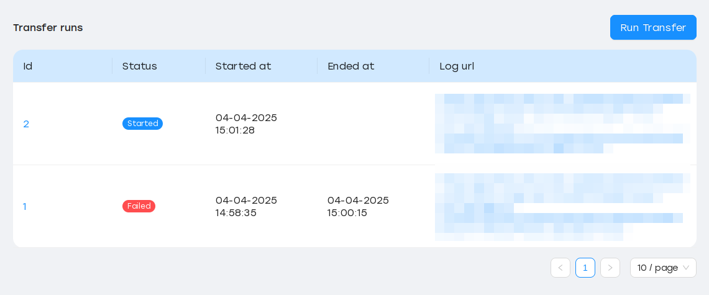
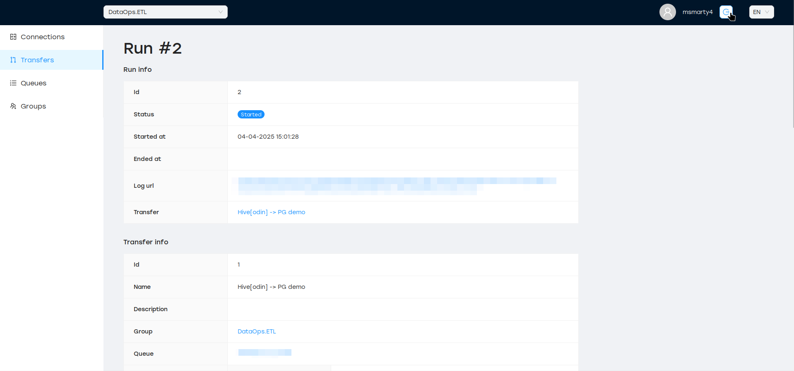

.. _entities:

Entities
========

User
----

SyncMaster is designed with multitenancy support and role-based access (see :ref:`role-permissions`).
All nteraction requires user authentication, there is no anonymous access allowed.

Users are automatically after successful login, there is no special registration step.

Group
-----

All entity types (Connection, Transfer, Run, Queue) can be created only within some group.
Groups are independent from each other, and have globally unique name.

Group can be created by any user, which automatically get ``OWNER`` role.
This role allows adding members to the group, and assign them speficic roles:

.. image:: ./group_add_member.png

Connection
----------

Connection describes how SyncMaster can access specific database or filesystem. It has a type (e.g. ``s3``, ``hive``, ``postgres``),
connection parameters (e.g. ``host``, ``port``, ``protocol``) and auth data (``user`` / ``password`` combination).

Connections have unique name within the group.

.. image:: ./connection_info_fs.png

Transfer
--------

Transfer is the heart of SyncMaster. It describes what some data should be fetched from a source (DB connection + table name, FileSystem connection + directory path),
and what the target is (DB or FileSystem).

Transfers have unique name within a group.

It is possible to add transformations between reading and writing steps:

Other transfer features are:
  * Choose different read strategies (``full``, ``incremental``)
  * Execute transfer on schedule (hourly, daily, weekly and so on)
  * Set specific resources (CPU, RAM) for each transfer run

Run
---

Each time transfer is started (manually or at some schedule), SyncMaster creates dedicated Run
which tracks the ETL process status, URL to worker logs and so on.

Queue
-----

Queue allows to bind specific transfer to a set of SyncMaster :ref:`worker`.

Queue have unique name within a group, and globally unique ``slug`` field which is generated during queue creation.

Transfers cannot be created without queue. If there are no workers bound to a queue, created runs will not be executed.

Entity Diagram
--------------

.. plantuml::

    @startuml
    title Entity Diagram

    left to right direction

    entity User {
        * id
        ----
        username
        is_active
        is_superuser
        created_at
        updated_at
    }

    entity Group {
        * id
        ----
        name
        description
        owner_id
        created_at
        updated_at
    }

    entity Connection {
        * id
        ----
        group_id
        type
        name
        description
        data
        created_at
        updated_at
    }

    entity Queue {
        * id
        ----
        name
        slug
        group_id
        description
        created_at
        updated_at
    }

    entity Transfer {
        * id
        ----
        group_id
        name
        source_connection_id
        target_connection_id
        strategy_params
        target_params
        transformations
        resources
        is_scheduled
        schedule
        queue_id
        created_at
        updated_at
    }

    entity Run {
        * id
        ----
        transfer_id
        started_at
        ended_at
        status
        type
        log_url
        transfer_dump
        created_at
        updated_at
    }

    Run ||--o{ Transfer
    Transfer ||--o{ Queue
    Transfer ||--o{ Connection
    Transfer ||--o{ Group
    Connection ||--o{ Group
    Queue ||--o{ Group
    Group }o--o{ User
    Group "owner_id" ||--o{ User

    @enduml
