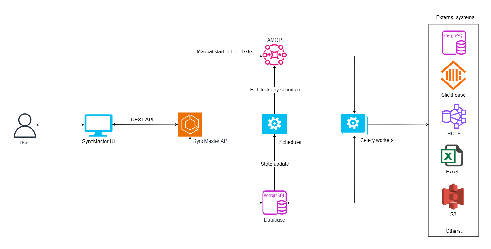

.. _architecture:

Architecture
============

Components
----------

SyncMaster contains the following components:

* :ref:`frontend`, main user interface.
* :ref:`server`, providing REST API for fetching and manipulating entities.
* :ref:`worker`, performing actual transfer work (ETL processes).
* :ref:`scheduler`, scheduling transfers to be executed in future.
* :ref:`database` for storing internal data.
* :ref:`message-broker` for communications between Server/Scheduler and Worker.

Architecture diagram
--------------------

