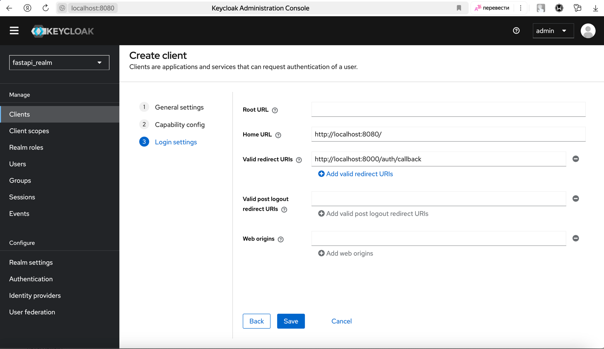

Local installation and testing
------------------------------

You can test Keycloak auth locally with docker compose:

.. code-block:: console

    $ docker compose -f docker-compose.test.yml up keycloak -d

Authorize in keycloak
~~~~~~~~~~~~~~~~~~~~~

At first, you have to go to `http://localhost:8080/admin <http://localhost:8080/admin>`_ and login via login: `admin`, password: `admin` (by default) to create realms.

.. image:: images/keycloak-login.png
   :width: 400px
   :align: center

Create new realm
~~~~~~~~~~~~~~~~

.. image:: images/keycloak-new-realm.png
   :width: 400px
   :align: center

Create new realm name
~~~~~~~~~~~~~~~~~~~~~

Pass realm name value. Then pass it to `SYNCMASTER__AUTH__KEYCLOAK__REALM_NAME` environment variable:

.. code-block:: console

    $ export SYNCMASTER__AUTH__KEYCLOAK__REALM_NAME=fastapi_realm  # as on screen below

.. image:: images/keycloak-new-realm_name.png
   :width: 400px
   :align: center

Create new client
~~~~~~~~~~~~~~~~~

.. image:: images/keycloak-new-client.png
   :width: 400px
   :align: center

Create new client name
~~~~~~~~~~~~~~~~~~~~~~

In created realm pass client name value. Then pass it to `SYNCMASTER__AUTH__KEYCLOAK__CLIENT_ID` environment variable:

.. code-block:: console

    $ export SYNCMASTER__AUTH__KEYCLOAK__CLIENT_ID=fastapi_client  # as on screen below

.. image:: images/keycloak-new-client_name.png
   :width: 400px
   :align: center

Set ``client_authentication`` **ON** to receive client_secret
~~~~~~~~~~~~~~~~~~~~~~~~~~~~~~~~~~~~~~~~~~~~~~~~~~~~~~~~~~~~~

.. image:: images/keycloak-client-authentication.png
   :width: 400px
   :align: center

Configure Redirect URI
~~~~~~~~~~~~~~~~~~~~~~

To configure the redirect URI where the browser will redirect to exchange the code provided from Keycloak for an access token, set the `SYNCMASTER__AUTH__KEYCLOAK__REDIRECT_URI` environment variable. The default value for local development is `http://localhost:8000/auth/callback`.

.. code-block:: console

    $ export SYNCMASTER__AUTH__KEYCLOAK__REDIRECT_URI=http://localhost:8000/auth/callback

Configure the client redirect URI
~~~~~~~~~~~~~~~~~~~~~~~~~~~~~~~~~

Ensure that this URI is also configured as a valid redirect URI in your Keycloak client settings. This allows the browser to redirect to your application after the user successfully authenticates with Keycloak.

Configure the client secret
~~~~~~~~~~~~~~~~~~~~~~~~~~~

Now go to **Credentials** tab and add the client secret to the `SYNCMASTER__AUTH__KEYCLOAK__CLIENT_SECRET` environment variable:

.. code-block:: console

    $ export SYNCMASTER__AUTH__KEYCLOAK__CLIENT_SECRET=6x6gn8uJdWSBmP8FqbNRSoGdvaoaFeez   # as on screen below

.. image:: images/keycloak-client-secret.png
   :width: 400px
   :align: center

Now you can use create users in this realms, check `keycloak documentation <https://www.keycloak.org/docs/latest/server_admin/#assembly-managing-users_server_administration_guide>`_ on how to manage users creation.

ENVIRONMENT VARIABLES
~~~~~~~~~~~~~~~~~~~~~

After this you can user `KeycloakAuthProvider` in your application with provided environment variables:

.. code-block:: console

    $ export SYNCMASTER__AUTH__KEYCLOAK__SERVER_URL=http://keycloak:8080
    $ export SYNCMASTER__AUTH__KEYCLOAK__REDIRECT_URI=http://localhost:8000/auth/callback
    $ export SYNCMASTER__AUTH__KEYCLOAK__REALM_NAME=fastapi_realm
    $ export SYNCMASTER__AUTH__KEYCLOAK__CLIENT_ID=fastapi_client
    $ export SYNCMASTER__AUTH__KEYCLOAK__CLIENT_SECRET=6x6gn8uJdWSBmP8FqbNRSoGdvaoaFeez
    $ export SYNCMASTER__AUTH__KEYCLOAK__SCOPE=email
    $ export SYNCMASTER__AUTH__KEYCLOAK__VERIFY_SSL=False
    $ export SYNCMASTER__AUTH__PROVIDER=syncmaster.server.providers.auth.keycloak_provider.KeycloakAuthProvider
