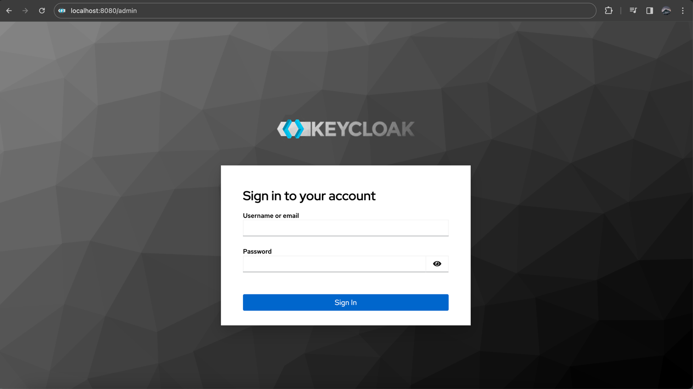
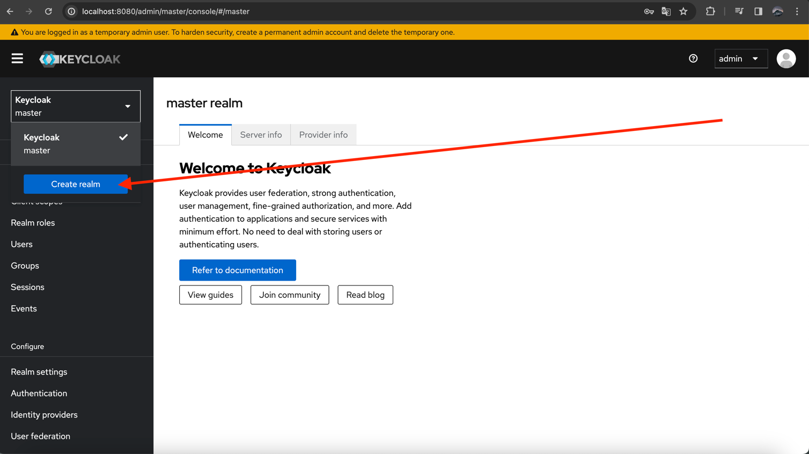
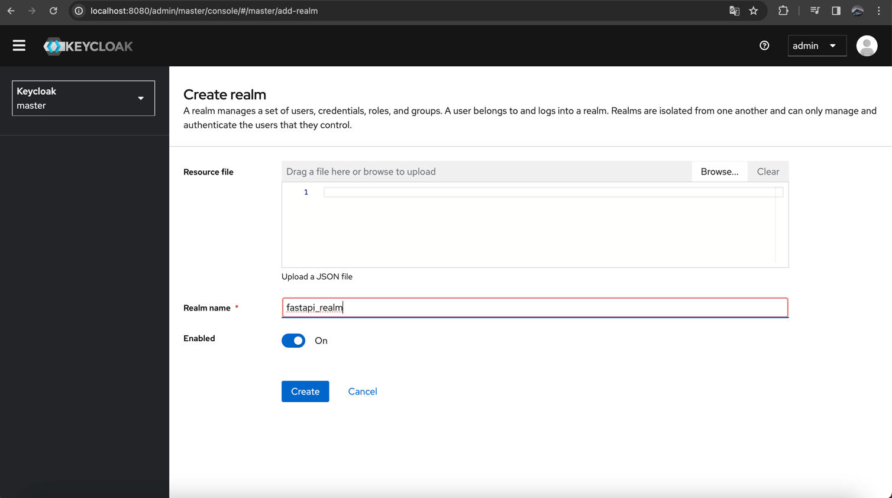
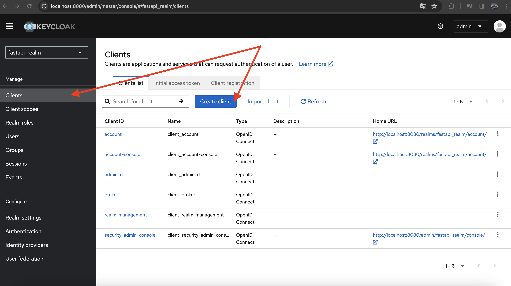
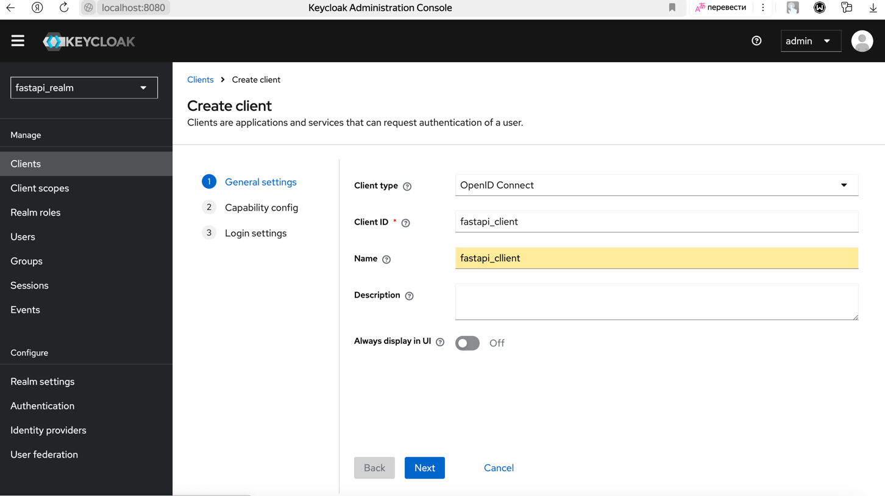
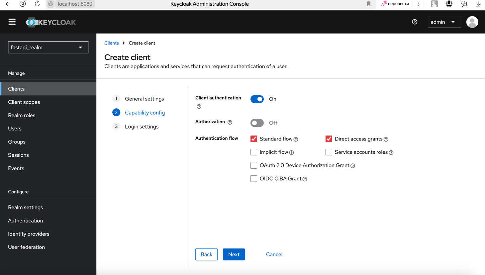
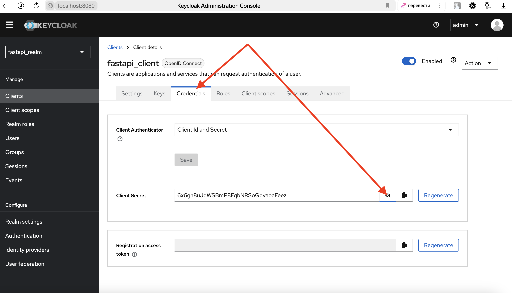
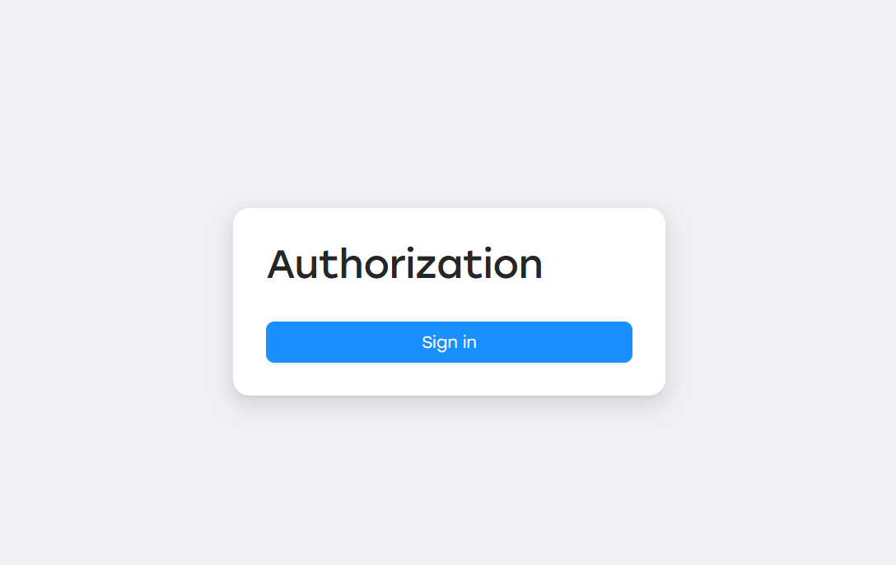

Local installation and testing
------------------------------

You can test Keycloak auth locally with docker compose:

.. code-block:: console

    $ docker compose -f docker-compose.test.yml up keycloak -d

Go to Keycloak Admin
~~~~~~~~~~~~~~~~~~~~~

Go to `Keycloak admin page <http://localhost:8080/admin>`_ and sign in using login: ``admin``, password: ``admin`` (by default):

Create new Realm
~~~~~~~~~~~~~~~~

Create new Realm with some name:

Save realm name to config file:

.. code-block:: yaml
    :caption: config.yml

    auth:
        keycloak:
            realm_name: fastapi_realm
            # ...

Create new Client
~~~~~~~~~~~~~~~~~

In created realm create new client and save its name to config:

.. code-block:: yaml
    :caption: config.yml

    auth:
        keycloak:
            client_id: fastapi_client
            # ...

Set ``client_authentication=ON`` to generate client_secret
~~~~~~~~~~~~~~~~~~~~~~~~~~~~~~~~~~~~~~~~~~~~~~~~~~~~~~~~~~~~~

Configure Redirect URI
~~~~~~~~~~~~~~~~~~~~~~

Set URI to redirect from Keycloak login page for exchanging the code for an access token:

.. image:: images/keycloak-client-ui_callback_url.png
   :width: 400px
   :align: center

.. code-block:: yaml
    :caption: config.yml

    auth:
        keycloak:
            # Set here URL of SyncMaster UI page handling callback redirects
            ui_callback_url: http://localhost:3000/auth/callback
            # ...

Configure the client secret
~~~~~~~~~~~~~~~~~~~~~~~~~~~

Now go to **Credentials** tab and generate a client secret:

.. code-block:: yaml
    :caption: config.yml

    auth:
        keycloak:
            client_id: fastapi_client
            client_secret: 6x6gn8uJdWSBmP8FqbNRSoGdvaoaFeez

Now you can use create users in this realm, check `Keycloak documentation <https://www.keycloak.org/docs/latest/server_admin/#assembly-managing-users_server_administration_guide>`_ on how to manage users creation.

Cookie encryption secret
~~~~~~~~~~~~~~~~~~~~~~~~

Keycloak access & refresh tokens are stored in cookie with server-side encryption.
So we need to generate random string to use as encryption key:

.. code-block:: yaml
    :caption: config.yml

    auth:
        cookie:
            secret_key: secret_key_for_session_cookie

Replace login page with Keycloak redirect button
~~~~~~~~~~~~~~~~~~~~~~~~~~~~~~~~~~~~~~~~~~~~~~~~

.. code-block:: yaml
    :caption: config.yml

    ui:
        auth_provider: keycloakAuthProvider

Final configuration
~~~~~~~~~~~~~~~~~~~

After this you can use ``KeycloakAuthProvider`` in your application:

.. code-block:: yaml
    :caption: config.yml

    auth:
        provider: syncmaster.server.providers.auth.keycloak_provider.KeycloakAuthProvider
        keycloak:
            # Keycloak URL accessible from both SyncMaster server and from browser
            api_url: http://keycloak:8080
            # Set here URL of SyncMaster UI page handling callback redirects
            ui_callback_url: http://localhost:3000/auth/callback
            realm_name: fastapi_realm
            client_id: fastapi_client
            client_secret: 6x6gn8uJdWSBmP8FqbNRSoGdvaoaFeez
            scope: email
            verify_ssl: false
        cookie:
            secret_key: secret_key_for_session_cookie

    ui:
        auth_provider: keycloakAuthProvider
        # SyncMaster API URL, accessible from browser
        api_browser_url: http://localhost:8000
