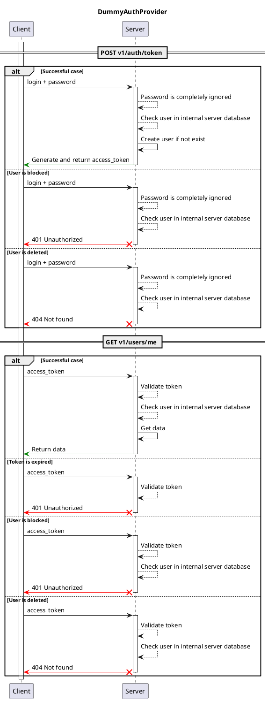

# Dummy Auth provider { #server-auth-dummy }

## Description { #server-auth-dummy-description }

This auth provider allows to sign-in with any username and password, and and then issues an access token.

After successful auth, username is saved to server database.

## Interaction schema { #server-auth-dummy-interaction-shema}

## Configuration { #server-auth-dummy-configuration }

::: syncmaster.server.settings.auth.dummy.DummyAuthProviderSettings

::: syncmaster.server.settings.auth.jwt.JWTSettings
