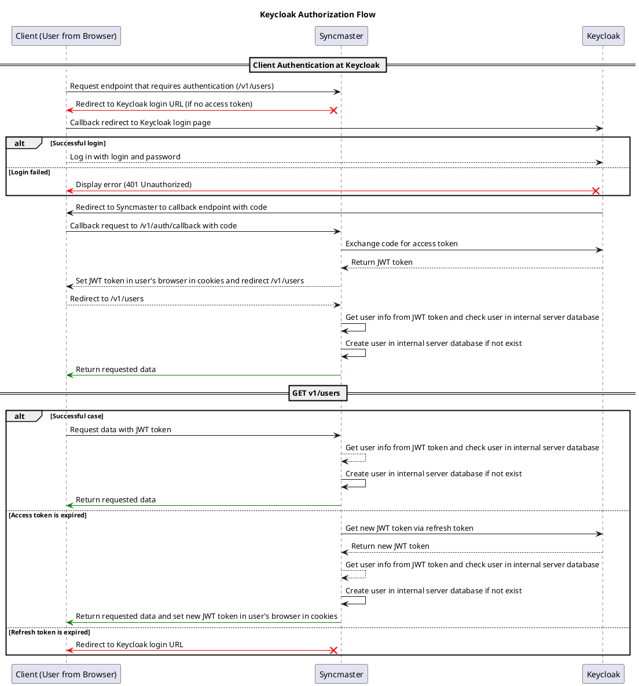

# KeyCloak Auth provider { #keycloak-auth-provider }

## Description { #keycloak-auth-provider-description }

Keycloak auth provider uses [python-keycloak](https://pypi.org/project/python-keycloak/) library to interact with Keycloak server. During the authentication process,
KeycloakAuthProvider redirects user to Keycloak authentication page.

After successful authentication, Keycloak redirects user back to Syncmaster with authorization code.
Then KeycloakAuthProvider exchanges authorization code for an access token and uses it to get user information from Keycloak server.
If user is not found in Syncmaster database, KeycloakAuthProvider creates it. Finally, KeycloakAuthProvider returns user with access token.

You can follow interaction schema below.

## Interaction schema { #keycloak-auth-provider-interaction-schema }

## Basic configuration { #keycloak-auth-provider-basic-configuration }

::: syncmaster.server.settings.auth.keycloak.KeycloakAuthProviderSettings

::: syncmaster.server.settings.auth.keycloak.KeycloakSettings

::: syncmaster.server.settings.auth.jwt.JWTSettings

## Keycloak

- [Local installation][local_installation]
