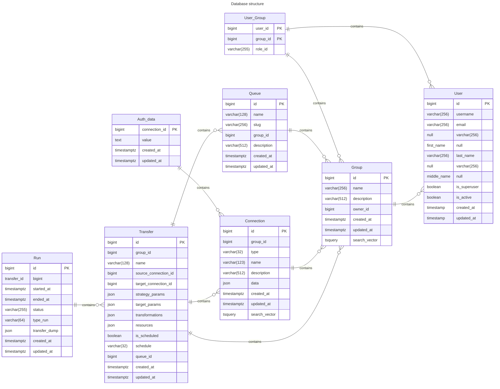

# Database structure { #database-structure }

```mermaid
---
title: Database structure
---
erDiagram
    direction LR
    User_Group {
        bigint user_id PK
        bigint group_id PK
        varchar(255) role_id
    }

    User {
        bigint id  PK
        varchar(256) username
        varchar(256) email  null
        varchar(256) first_name null
        varchar(256) last_name null
        varchar(256) middle_name null
        boolean is_superuser
        boolean is_active
        timestamp created_at
        timestamp updated_at
    }

    Group {
        bigint id  PK
        varchar(256) name
        varchar(512) description
        bigint owner_id
        timestamptz created_at
        timestamptz updated_at
        tsquery search_vector
    }

    Queue {
        bigint id PK
        varchar(128) name
        varchar(256) slug
        bigint group_id
        varchar(512) description
        timestamptz created_at
        timestamptz updated_at
    }

    Connection {
        bigint id PK
        bigint group_id
        varchar(32) type
        varchar(123) name
        varchar(512) description
        json data
        timestamptz created_at
        timestamptz updated_at
        tsquery search_vector
    }

    Auth_data {
        bigint connection_id PK
        text value
        timestamptz created_at
        timestamptz updated_at
    }

    Transfer {
        bigint id PK
        bigint group_id
        varchar(128) name
        bigint source_connection_id
        bigint target_connection_id
        json strategy_params
        json target_params
        json transformations
        json resources
        boolean is_scheduled
        varchar(32) schedule
        bigint queue_id
        timestamptz created_at
        timestamptz updated_at
    }

    Run {
        bigint id PK
        transfer_id bigint
        timestamptz started_at
        timestamptz ended_at
        varchar(255) status
        varchar(64) type_run
        json transfer_dump
        timestamptz created_at
        timestamptz updated_at
    }

    User_Group ||--o{ User: contains
    User_Group ||--o{ Group: contains
    Group ||--o{ User: contains
    Queue ||--o{ Group: contains
    Connection ||--o{ Group: contains
    Auth_data ||--o{ Connection: contains
    Transfer ||--o{ Queue: contains
    Transfer ||--o{ Connection: contains
    Transfer ||--o{ Group: contains
    Run ||--o{ Transfer: contains
```
