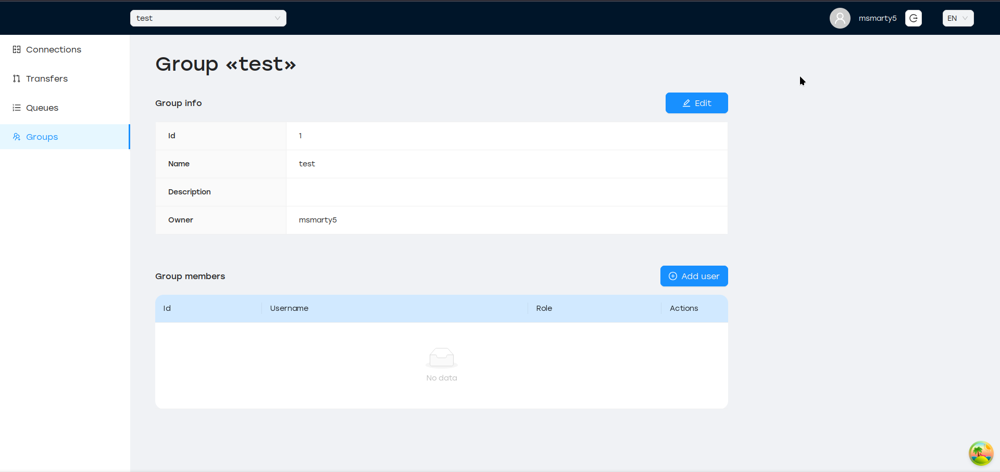
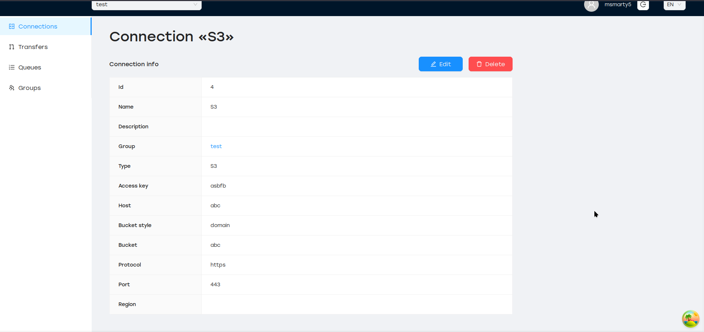
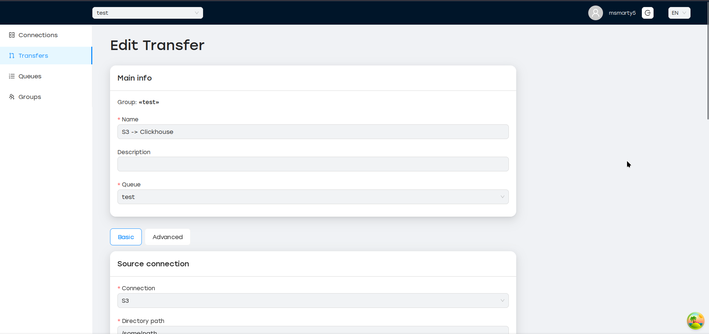
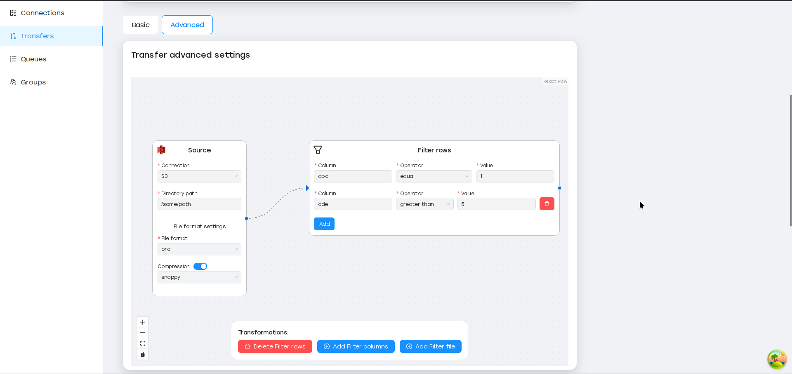
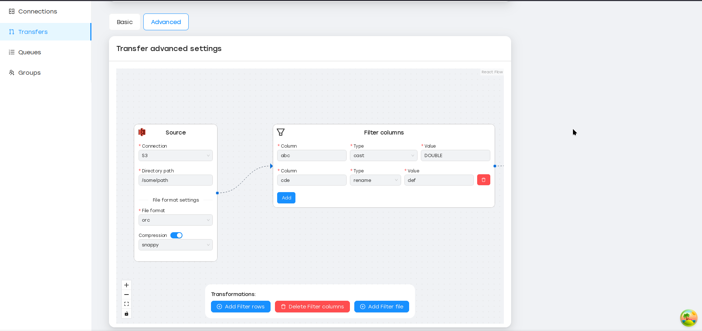
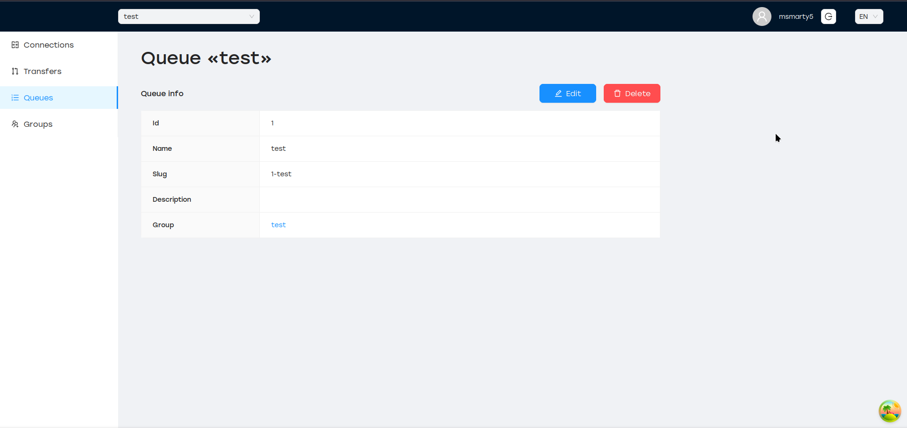
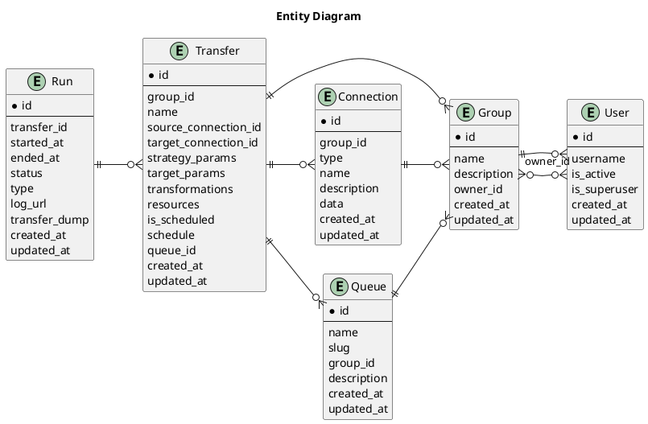

# Сущности { #entities }

## Пользователь

SyncMaster поддерживает многопользовательскую систему и доступ на основе ролей (см. [Роли и разрешения][role-permissions]).
Для любого взаимодействия требуется аутентификация пользователя, анонимный доступ не допускается.

Пользователи автоматически получают доступ после успешного входа в систему, специальной регистрации не требуется.

## Группа

Все типы сущностей (Подключение, Передача, Выполнение, Очередь) могут быть созданы только внутри определенной группы.
Группы независимы друг от друга и имеют глобально уникальное имя.

Группу может создать любой пользователь, которому автоматически назначается роль `OWNER`.
Эта роль позволяет добавлять участников в группу и назначать им определенные роли:

## Подключение

Подключение описывает, как SyncMaster может получить доступ к конкретной базе данных или файловой системе. Оно включает тип (например, `s3`, `hive`, `postgres`),
параметры подключения (например, `host`, `port`, `protocol`) и данные авторизации (комбинация `user` / `password`).

Подключения имеют уникальные имена в пределах группы.

## Трансфер

Трансфер — это сердце SyncMaster. Он описывает, какие данные следует извлечь из источника (подключение к БД + имя таблицы, подключение к файловой системе + путь к каталогу),
и какова цель (БД или файловая система).

Передачи имеют уникальное имя в пределах группы.

Можно добавить преобразования между этапами чтения и записи:

Другие возможности переноса:

- Выбор различных стратегий чтения (`полный`, `пошаговый`)
- Выполнение переноса по расписанию (ежечасно, ежедневно, еженедельно и т. д.)
- Задание определённых ресурсов (ЦП, ОЗУ) для каждого выполнения переноса

## Запуск

Каждый раз при запуске передачи (вручную или по расписанию) SyncMaster создаёт отдельный запуск,
который отслеживает состояние процесса ETL, URL-адрес журналов рабочих процессов и т. д.

## Очередь

Очередь позволяет привязать определённую передачу к набору SyncMaster [Worker][reference-worker]

Очередь имеет уникальное имя в пределах группы и глобально уникальное поле `slug`, которое генерируется при создании очереди.

Передачи невозможно создать без очереди. Если к очереди не привязан ни один исполнитель, созданные запуски не будут выполнены.

## Диаграмма сущностей

