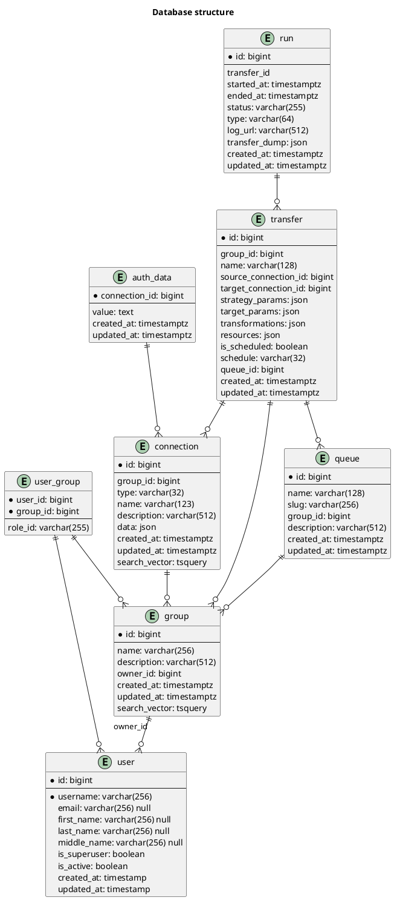
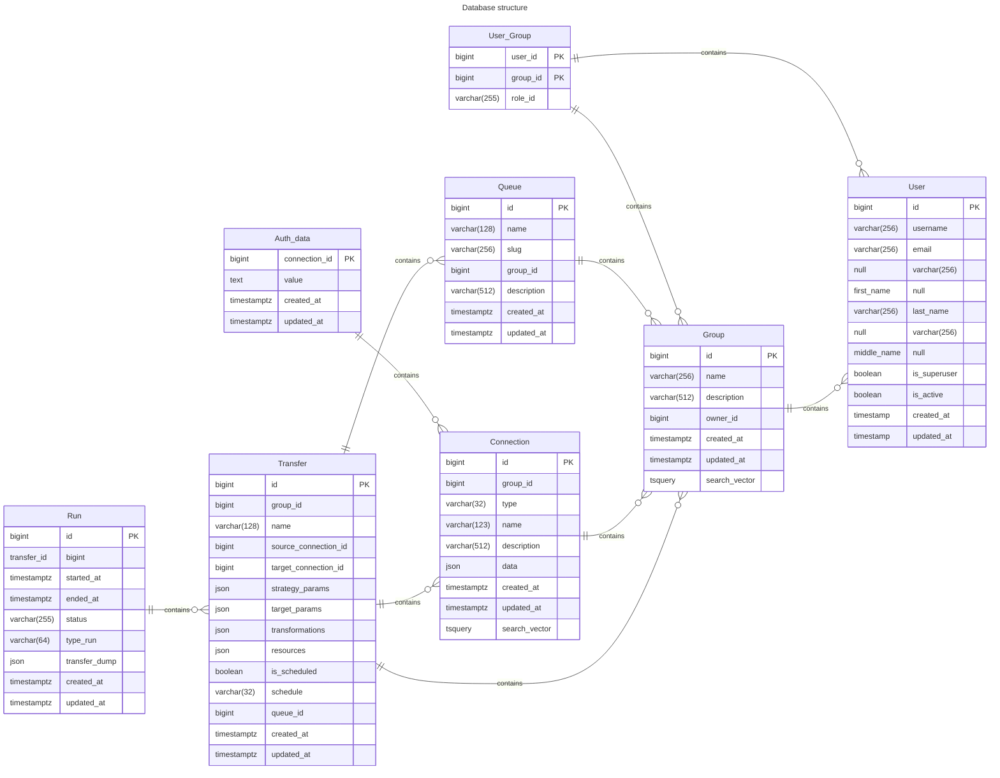

# Структура базы данных { #database-structure }

% https://plantuml.com/en/ie-diagram

```plantuml

    @startuml
    title Database structure

    entity user {
        * id: bigint
        ----
        * username: varchar(256)
        email: varchar(256) null
        first_name: varchar(256) null
        last_name: varchar(256) null
        middle_name: varchar(256) null
        is_superuser: boolean
        is_active: boolean
        created_at: timestamp
        updated_at: timestamp
    }

    entity group {
        * id: bigint
        ----
        name: varchar(256)
        description: varchar(512)
        owner_id: bigint
        created_at: timestamptz
        updated_at: timestamptz
        search_vector: tsquery
    }

    entity user_group {
        * user_id: bigint
        * group_id: bigint
        ----
        role_id: varchar(255)
    }

    entity connection {
        * id: bigint
        ----
        group_id: bigint
        type: varchar(32)
        name: varchar(123)
        description: varchar(512)
        data: json
        created_at: timestamptz
        updated_at: timestamptz
        search_vector: tsquery
    }

    entity auth_data {
        * connection_id: bigint
        ----
        value: text
        created_at: timestamptz
        updated_at: timestamptz
    }

    entity queue {
        * id: bigint
        ----
        name: varchar(128)
        slug: varchar(256)
        group_id: bigint
        description: varchar(512)
        created_at: timestamptz
        updated_at: timestamptz
    }

    entity transfer {
        * id: bigint
        ----
        group_id: bigint
        name: varchar(128)
        source_connection_id: bigint
        target_connection_id: bigint
        strategy_params: json
        target_params: json
        transformations: json
        resources: json
        is_scheduled: boolean
        schedule: varchar(32)
        queue_id: bigint
        created_at: timestamptz
        updated_at: timestamptz
    }

    entity run {
        * id: bigint
        ----
        transfer_id
        started_at: timestamptz
        ended_at: timestamptz
        status: varchar(255)
        type: varchar(64)
        log_url: varchar(512)
        transfer_dump: json
        created_at: timestamptz
        updated_at: timestamptz
    }

    user_group ||--o{ user
    user_group ||--o{ group

    group "owner_id" ||--o{ user

    queue ||--o{ group

    connection ||--o{ group
    auth_data ||--o{ connection

    transfer ||--o{ queue
    transfer ||--o{ connection
    transfer ||--o{ group

    run ||--o{ transfer

    @enduml
```

```mermaid
---
title: Database structure
---
erDiagram
    direction LR
    User_Group {
        bigint user_id PK
        bigint group_id PK
        varchar(255) role_id 
    }

    User {
        bigint id  PK       
        varchar(256) username  
        varchar(256) email  null 
        varchar(256) first_name null
        varchar(256) last_name null
        varchar(256) middle_name null
        boolean is_superuser
        boolean is_active
        timestamp created_at
        timestamp updated_at
    }

    Group {
        bigint id  PK
        varchar(256) name 
        varchar(512) description
        bigint owner_id
        timestamptz created_at 
        timestamptz updated_at
        tsquery search_vector
    }

    Queue {
        bigint id PK
        varchar(128) name
        varchar(256) slug
        bigint group_id
        varchar(512) description
        timestamptz created_at
        timestamptz updated_at
    }

    Connection {
        bigint id PK
        bigint group_id 
        varchar(32) type
        varchar(123) name 
        varchar(512) description
        json data
        timestamptz created_at 
        timestamptz updated_at
        tsquery search_vector
    }

    Auth_data {
        bigint connection_id PK
        text value
        timestamptz created_at
        timestamptz updated_at
    }

    Transfer {
        bigint id PK
        bigint group_id
        varchar(128) name
        bigint source_connection_id
        bigint target_connection_id
        json strategy_params
        json target_params
        json transformations
        json resources
        boolean is_scheduled
        varchar(32) schedule
        bigint queue_id
        timestamptz created_at
        timestamptz updated_at
    }

    Run {
        bigint id PK
        transfer_id bigint
        timestamptz started_at
        timestamptz ended_at
        varchar(255) status
        varchar(64) type_run
        json transfer_dump
        timestamptz created_at
        timestamptz updated_at
    }

    User_Group ||--o{ User: contains
    User_Group ||--o{ Group: contains
    Group ||--o{ User: contains
    Queue ||--o{ Group: contains
    Connection ||--o{ Group: contains
    Auth_data ||--o{ Connection: contains
    Transfer ||--o{ Queue: contains
    Transfer ||--o{ Connection: contains
    Transfer ||--o{ Group: contains
    Run ||--o{ Transfer: contains
```
