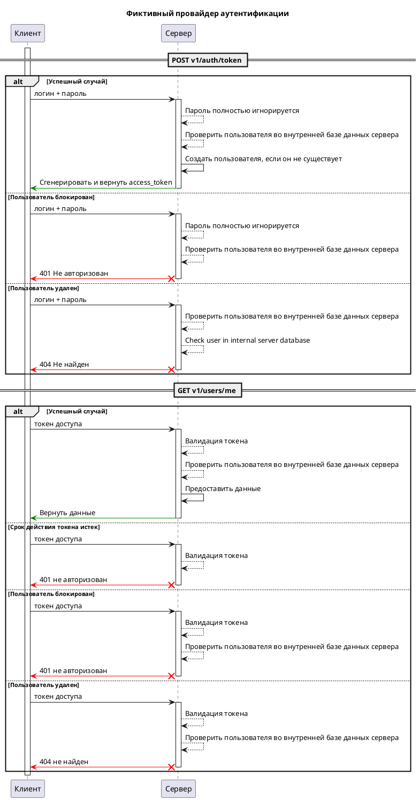
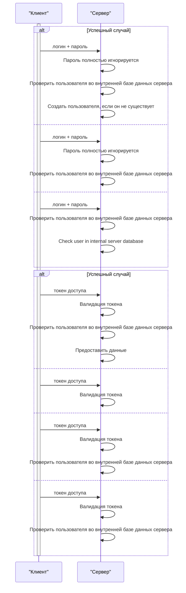

# Фиктивный провайдер аутентификации { #server-auth-dummy }

## Описание { #server-auth-dummy-description }

Этот провайдер аутентификации позволяет войти в систему с любым именем пользователя и паролем, а затем выдаёт токен доступа.

После успешной аутентификации имя пользователя сохраняется в базе данных сервера.

## Схема взаимодействия { #server-auth-dummy-interaction-shema}

## Конфигурация { #server-auth-dummy-configuration }

::: syncmaster.server.settings.auth.dummy.DummyAuthProviderSettings

::: syncmaster.server.settings.auth.jwt.JWTSettings
