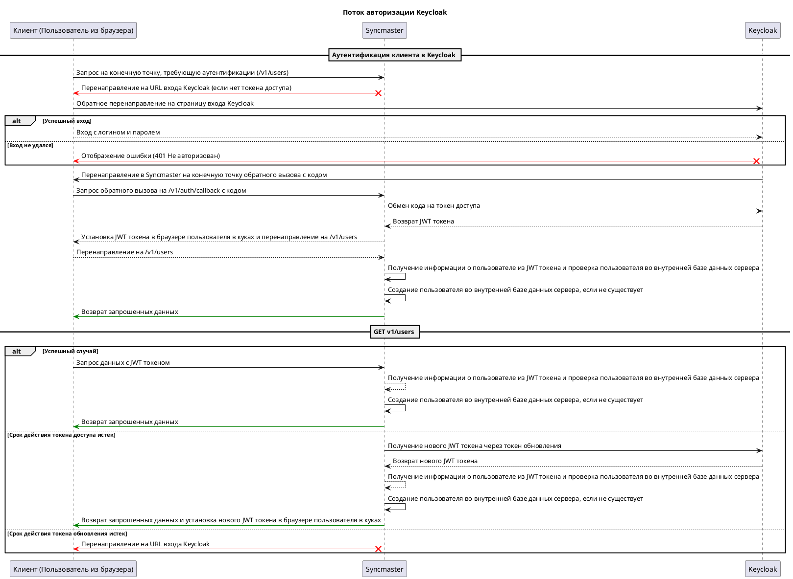

# Провайдер аутентификации KeyCloak { #keycloak-auth-provider }

## Описание { #keycloak-auth-provider-description }

Провайдер аутентификации Keycloak использует библиотеку [python-keycloak](https://pypi.org/project/python-keycloak/) для взаимодействия с сервером Keycloak. В процессе аутентификации провайдер аутентификации Keycloak перенаправляет пользователя на страницу аутентификации Keycloak.

После успешной аутентификации Keycloak перенаправляет пользователя обратно в Syncmaster с кодом авторизации.
Затем провайдер аутентификации Keycloak обменивает код авторизации на токен доступа и использует его для получения информации о пользователе с сервера Keycloak.
Если пользователь не найден в базе данных Syncmaster, провайдер аутентификации Keycloak создает его. Наконец, провайдер аутентификации Keycloak возвращает пользователя с токеном доступа.

Вы можете ознакомиться со схемой взаимодействия ниже.

## Схема взаимодействия { #keycloak-auth-provider-interaction-schema }



```mermaid
sequenceDiagram
participant "Клиент (Пользователь из браузера)" as Client
participant "Syncmaster"
participant "Keycloak"

Client ->> Syncmaster : Запрос на конечную точку, требующую аутентификации (/v1/users)

Syncmaster --x Client: Перенаправление на URL-адрес входа в Keycloak (если нет токена доступа)

Client ->> Keycloak : Обратное перенаправление на страницу входа Keycloak
alt Успешный вход
Client ->> Keycloak : Вход с логином и паролем
else Login failed
Keycloak --x Client: Отображение ошибки (401 Неавторизован)
end

Keycloak ->> Client : Перенаправление в Syncmaster на конечную точку обратного вызова с кодом
Client ->> Syncmaster : Запрос обратного вызова на /v1/auth/callback с кодом
Syncmaster->> Keycloak : Обмен кода на токен доступа
Keycloak ->> Syncmaster : Возврат JWT токена
Syncmaster ->> Client : Установка JWT токена в браузере пользователя в куках и перенаправление на /v1/users

Client ->> Syncmaster : Перенаправление на /v1/users
Syncmaster ->> Syncmaster : Получение информации о пользователе из JWT токена и проверка пользователя во внутренней базе данных сервера
Syncmaster ->> Syncmaster : Создание пользователя во внутренней базе данных сервера, если не существует
Syncmaster ->> Client: Возврат запрошенных данных

alt Успешный случай
Client ->> Syncmaster : Запрос данных с JWT токеном
Syncmaster ->> Syncmaster : Получение информации о пользователе из JWT токена и проверка пользователя во внутренней базе данных сервера
Syncmaster ->> Syncmaster : Создание пользователя во внутренней базе данных сервера, если не существует
Syncmaster ->> Client: Возврат запрошенных данных

else Access token is expired
Syncmaster ->> Keycloak : Получение нового JWT токена через токен обновления
Keycloak ->> Syncmaster : Возврат нового JWT токена
Syncmaster ->> Syncmaster : Получение информации о пользователе из JWT токена и проверка пользователя во внутренней базе данных сервера
Syncmaster ->> Syncmaster : Создание пользователя во внутренней базе данных сервера, если не существует
Syncmaster ->> Client: Возвращает запрошенные данные и устанавливает новый токен JWT в браузере пользователя в файлах cookie.
else Refresh token is expired
Syncmaster --x Client: Перенаправление на URL-адрес входа в Keycloak
end

deactivate Client
```

## Базовая конфигурация { #keycloak-auth-provider-basic-configuration }

::: syncmaster.server.settings.auth.keycloak.KeycloakAuthProviderSettings

::: syncmaster.server.settings.auth.keycloak.KeycloakSettings

::: syncmaster.server.settings.auth.jwt.JWTSettings

## Keycloak

- [Локальная установка][local_installation]
